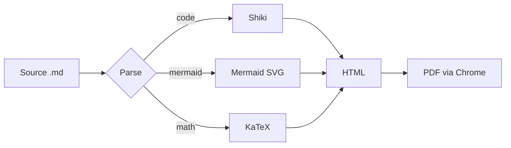
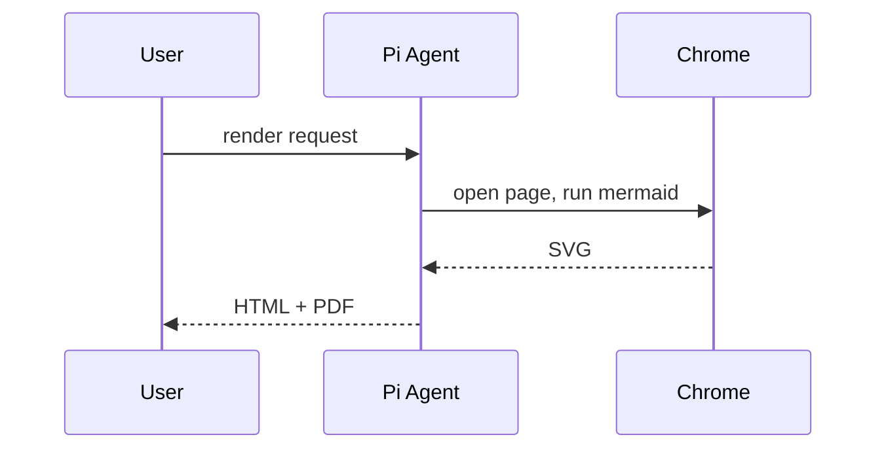
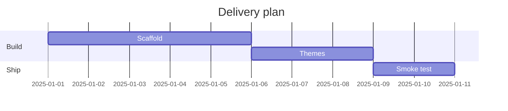

# Markdown Render Sample

A comprehensive exercise of every feature the renderer supports.

## Text basics

Paragraph with **bold**, *italic*, ***both***, ~~strikethrough~~, ==highlighted==, H~2~O, x^2^, `inline code`, a [link](https://example.com), and an autolink: https://example.com.

> A plain blockquote with a nested list:
> 1. first
> 2. second

> [!NOTE]
> Useful information readers should know.

> [!WARNING]
> Contents may be destructive.

## Lists

1. Ordered item
2. Second item
   - nested bullet
   - another

- [x] finished task
- [ ] open task

Term one
: Definition of term one.

Term two
: Definition of term two.

## Table

| Feature | Status | Notes |
| ------- | ------ | ----- |
| Tables  | ✅ | GFM pipe tables |
| Math    | ✅ | KaTeX inline and display |

## Code

```typescript
interface Doc {
	title: string;
	tags: string[];
}
export const d: Doc = { title: "sample", tags: ["a", "b"] };
```

```bash
cat sample.md | md_render --format pdf
```

```python
def fib(n: int) -> int:
    return n if n < 2 else fib(n - 1) + fib(n - 2)
```







## Math

Inline math like $E = mc^2$ and a display equation:

$$
\int_{-\infty}^{\infty} e^{-x^2} \, dx = \sqrt{\pi}
$$

## Footnote with emphasis[^1]

[^1]: Footnote bodies support **formatting** too.

---

### Image (local, if present)


### Entities & symbols

© ™ → ← ± × ÷ ≠ ≤ ≥ — – …
